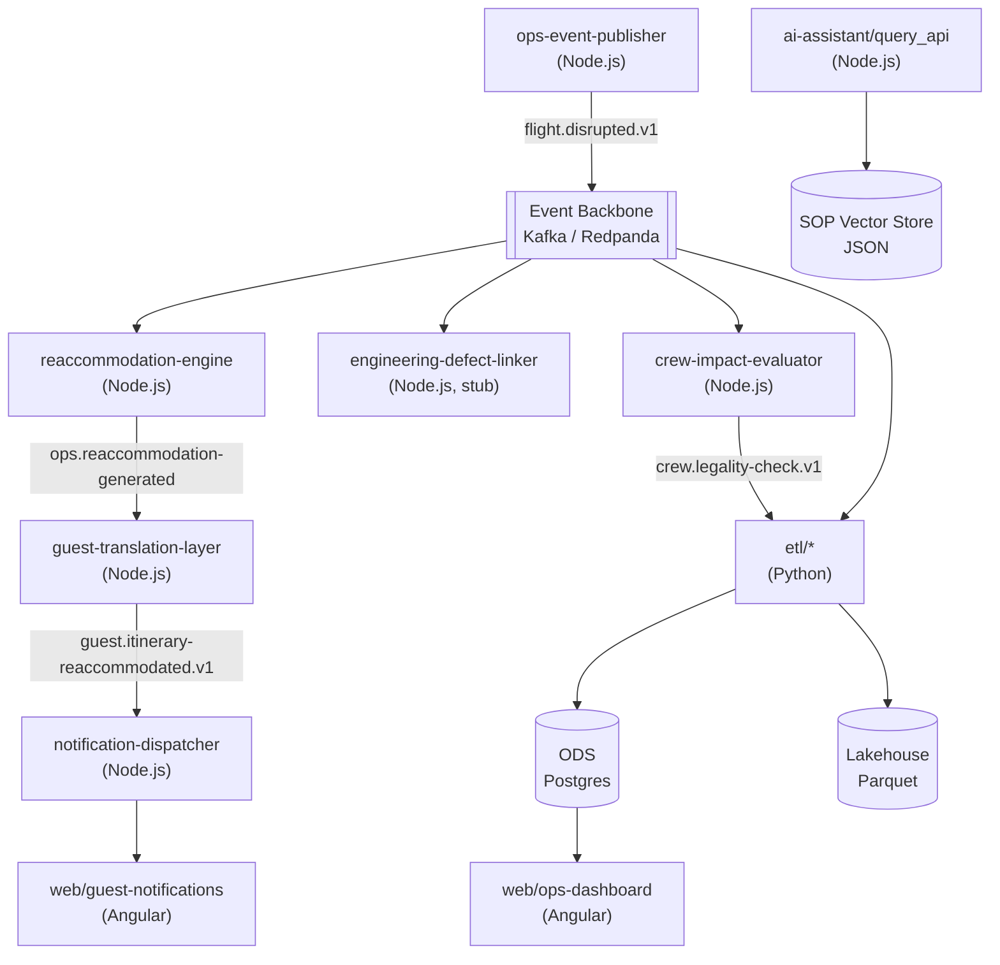

# Container Diagram

Each Node.js box in `services/` is an independently deployable process with its own `package.json` — see [ADR 0001](../03-adr/0001-events-not-apis-for-disruption.md) for why they communicate only through the event backbone.
