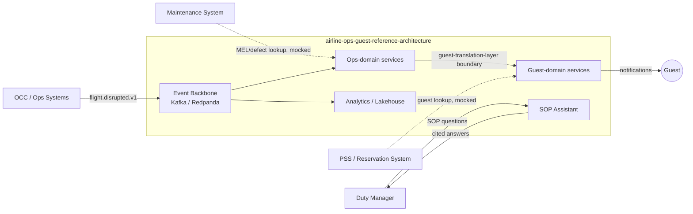

# Context Diagram

This is the system-in-context view: real OCC, maintenance, and PSS systems are mocked at their integration boundary (see [ADR 0004](../03-adr/0004-legacy-protocol-adapter-pattern.md)); everything inside the box is this repo.
