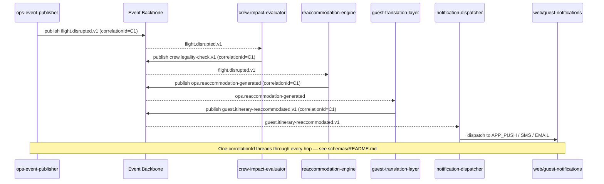

# IROPS Sequence Diagram

`crew-impact-evaluator` and `reaccommodation-engine` react to the same `flight.disrupted.v1` event independently and concurrently — this is the fan-out that [ADR 0001](../03-adr/0001-events-not-apis-for-disruption.md) is designed to enable.
